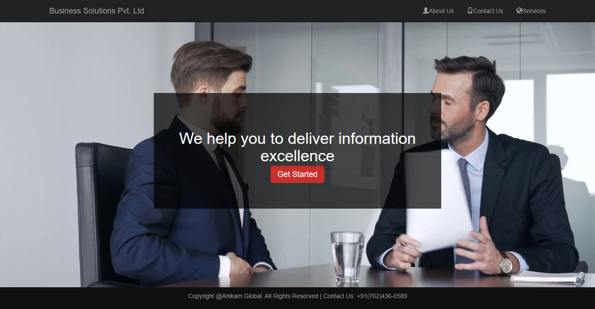
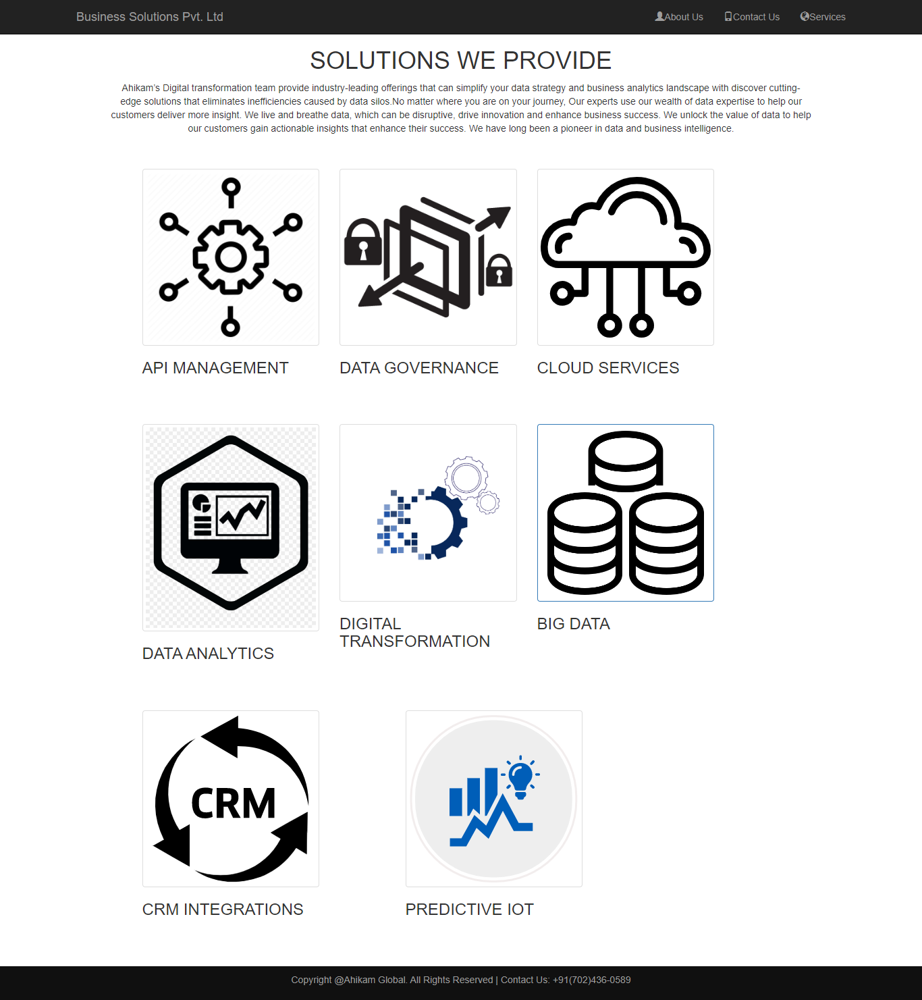
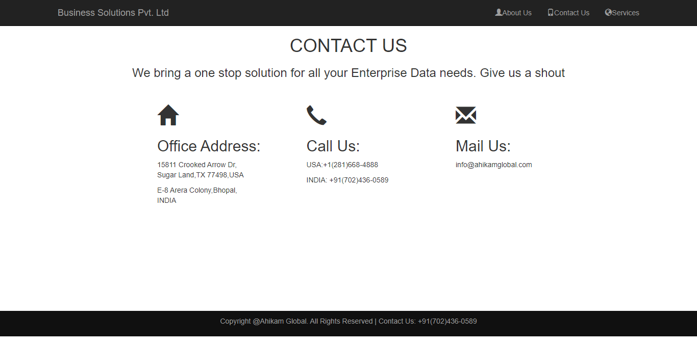

# Business Solutions Website

***
## Description

This project [Business Solutions Website](https://business-bootstrap.netlify.app)[Front-end] is a collection of various webpages for firm that provides IT solutions and was built using Semantic HTML, CSS and **Bootstrap** from scratch.This project was build for just fun because of its simple UI and to brush up Bootstrap. This project has various webpages including Home page, services page, contact page, and so on.

***

### Links for Project

* <a href="https://business-bootstrap.netlify.app" target="_blank">Live Project Link</a>

* [Youtube Video Demo](https://youtu.be/7IDhXqJjExA)

* [Source Code](https://github.com/ShubhamSingh03/Business-Solutions-Website)

***
### Built With 

* Semantic HTML
* Bootstrap

***

### Key Learnings

* Learned to create multiple pages for the same websites and link them(front-end)
* Learned to read [Bootstrap Docs](https://getbootstrap.com/docs/4.1/getting-started/introduction/) more efficiently
* Used Bootstrap components when necessary

***

### Time Taken to finish this project
 

>2 hours to build it from scratch.

 

***

### Screencaptures of Project

 

  1. ### Home Page

   

  

   

  2. ### Services Page

 

 

  3. ### Contact Page 

   

  

   

    

***
 

### Checkout Portfolio & Other Projects

#### [Personal Portfolio](https://shubhambhoj.in/)

#### [Findcoder Profile](https://www.findcoder.io/u/shubham_singh)
***

### Connect with Me
* [Mailto](mailto:shubhambhoj3@gmail.com)
* [LinkedIn](https://www.linkedin.com/in/shubham-singh-b122b7171/)
* [Github](https://github.com/ShubhamSingh03)
* [Findcoder](https://www.findcoder.io/u/shubham_singh)
***
***
[go to top](#business-solutions-website)